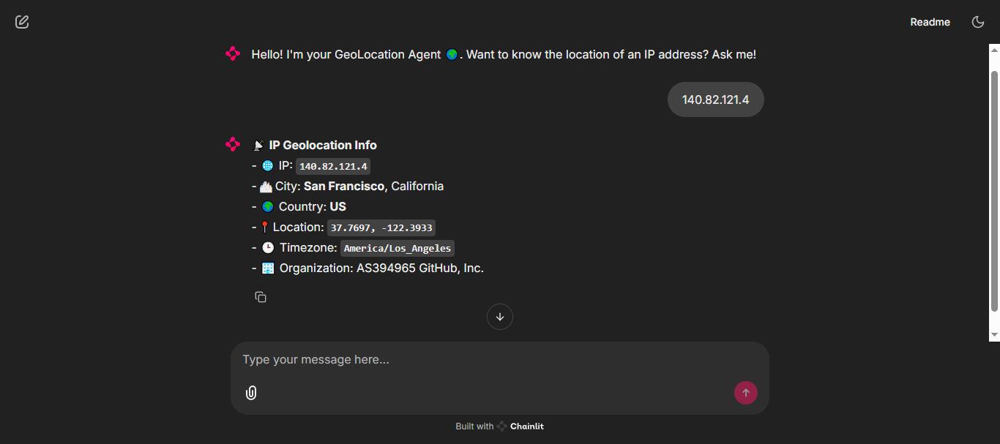
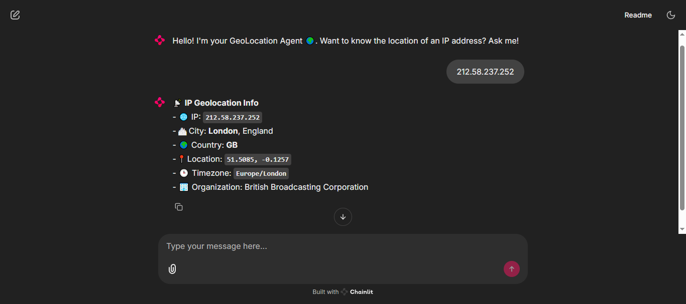

# 🌍 IP Geolocation Agent

[](https://chainlit.io)
[](https://python.org)

A conversational AI agent that retrieves detailed geolocation information for IP addresses using Chainlit and Gemini API.

| GitHub | BBC UK |
|----------------|---------------|
|  |  |

## Features ✨
- 🗺️ Real-time IP geolocation lookup
- 💬 Interactive chat interface with conversation history
- 📊 Structured data presentation with emoji indicators
- 🧠 Custom agent with tool integration
- 🔒 Secure API key management

## Prerequisites 📋
- Python 3.9+
- [Chainlit](https://chainlit.io) UI
- [Gemini API key](https://aistudio.google.com/app/apikey) (free tier available)

## Installation 🛠️

```bash
# Clone repository
git clone https://github.com/EliAbdiel/geolocation-agent.git
cd geolocation-agent

# Create virtual environment
python -m venv venv

# Activate environment (Linux/Mac)
source venv/bin/activate

# Activate environment (Windows)
venv\Scripts\activate

# Install dependencies
pip install -r requirements.txt
```

## Configuration ⚙️

Create a `.env` file with your credentials:

```
GEMINI_API_KEY=your_gemini_api_key_here
GEMINI_ENDPOINT=https://generativelanguage.googleapis.com/v1beta/openai/
GEMINI_MODEL=gemini-2.0-flash
```

## Project Structure 📂

```
geolocation-agent/
├── public/
├── src/
│   └── geo_location_agent.py  # Agent logic, tools, and LocationInfo dataclass
├── app.py                      # Main Chainlit application
├── requirements.txt            # Dependencies
├── .env                        # Environment configuration
└── README.md                   # This documentation
```

## Usage 🚀

Start the application:

```bash
chainlit run app.py -h
```

Access the web interface at `http://localhost:8000`

## Output Format 📄

The agent returns structured information including:

- IP address
- City and region
- Country
- Latitude/Longitude coordinates
- Timezone
- Organization

Example output:

- 📡 **IP Geolocation Info**
- 🌐 IP: `8.8.8.8`
- 🏙 City: **Mountain View**, California
- 🌍 Country: **United States**
- 📍 Location: `37.4056, -122.0775`
- 🕒 Timezone: `America/Los_Angeles`
- 🏢 Organization: Google LLC

## Dependencies 📦

- `chainlit` - Conversational UI framework
- `agents` - Custom agent framework
- `requests` - HTTP requests
- `python-dotenv` - Environment management
- `openai` - Client for Gemini API

## Troubleshooting 🐞

**Common issues:**

1. `Invalid API Key` error: Verify your `.env` file configuration

2. `Location data unavailable`: Check if IP address is valid

3. `Connection errors`: Ensure internet connectivity and API endpoint accessibility
4. `AttributeError in LocationInfo`: Verify IP API response structure

**Debugging tips:**

- Remove `set_tracing_disabled(True)` to enable debug tracing
- Add error handling in `get_location_info()` for API responses
- Validate IP format before API call
- Check for API rate limits (ipapi.co allows 1000/day)

## License 📄

This project is licensed under the MIT License - see the LICENSE file for details.